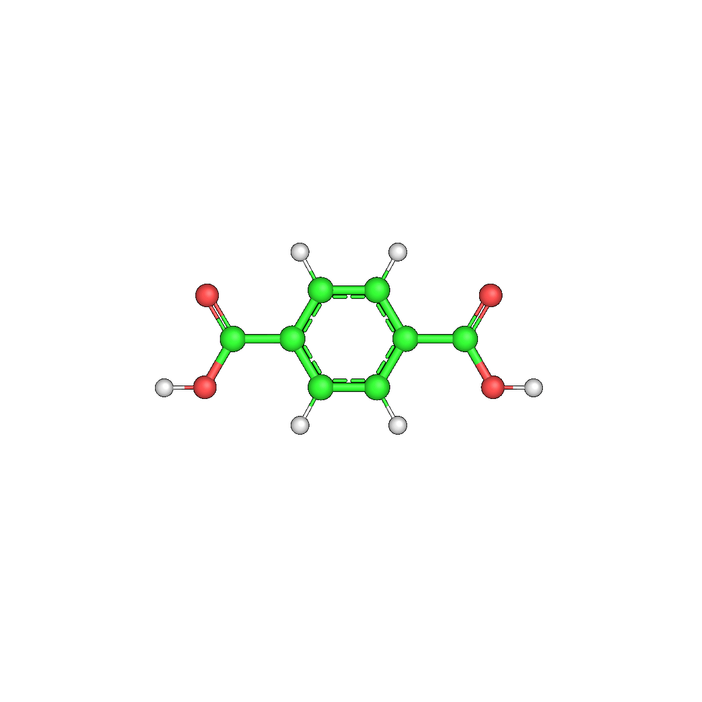
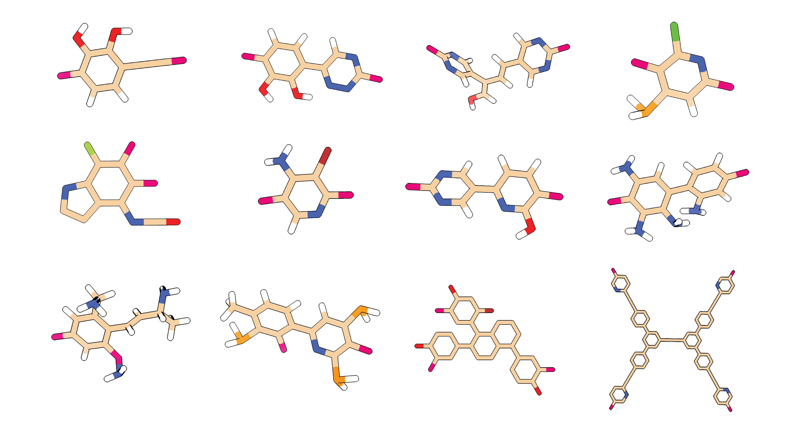

> 🚧 **Under Construction:**  
> This is an initial release of the functionality. Further documentation and cleanup are still in progress. Currently only model training and inference is supported. Everything currently documented in this README should be runnable. If you encounter challenges, reach out to dm958[at]cam[dot]ac[dot]uk.

> This repository will be under continuous development; a stable version will be released upon final publication.

# Nexerra-R1


Open-source code for NexerraR1 as described in the following \href{https://arxiv.org/abs/2603.20389}[pre-print].

```bib
@article{menon2026a,
  title={A chemical language model for reticular materials design},
  author={Menon, Dhruv and Singh, Vivek and Chen, Xu and Alizadeh Kiapi, Mohammad Reza and Zyuzin, Ivan and MacLeod, Hamish W and Rampal, Nakul and Shepard, William and Yaghi, Omar and Fairen-Jimenez, David},
  journal={arXiv preprint arXiv:2603.20389},
  year={2026}
}
```

This repository currently focuses on model training and inference for:
- direct linker design using the 'Direct Design' mode
- scaffold-constrained linker design using the 'Scaffold-constrained Design' mode
- flow-guided linker design using the 'Flow Design' mode

## Set-up
<a id="set-up"></a>

This repo is intended to be used through a curated Conda environment.

1. **Clone the repo**

2. **Create the supported Conda environment**

   From the repo root, run:

   ```bash
   conda env create -f environment.yml
   conda activate nexerra
   ```

   The provided `environment.yml` is a curated environment for the main Nexerra workflow.

3. **Add the repo to your `PYTHONPATH`**

   If you installed the repo into `/my/path/to/nexerra-R1`, run:

   ```bash
   export PYTHONPATH="/my/path/to/nexerra-R1"
   ```

4. **Keep the required repo artifacts in place**
5. 
   The current inference code expects these assets to exist:

   ```text
   artifacts/ckpt/vae/no_prop_vae_epoch_120.pt
   artifacts/ckpt/flow/otcfm_step_180000.pt
   artifacts/latent_banks/latent_bank.pt
   artifacts/latent_banks/latent_bank_len.pt
   data/processed/tokenized_dataset.pkl
   data/processed/train_smiles.txt
   designed/linker/inference_config.txt
   ```

6. **Download external runtime assets**

   Large runtime assets are intentionally not stored in Git. After cloning, fetch them from the Zenodo deposit into the expected locations.

   ```bash
   python setup_assets.py --zenodo-record 19100678
   ```

   The bootstrapper downloads the default runtime bundle into:
   - `artifacts/ckpt/vae/no_prop_vae_epoch_120.pt`
   - `artifacts/ckpt/flow/otcfm_step_180000.pt`
   - `artifacts/latent_banks/latent_bank.pt`
   - `artifacts/latent_banks/latent_bank_len.pt`
   - `data/processed/tokenized_dataset.pkl`

   Notes:
   - `zenodo_get` is the preferred download path for Zenodo-hosted assets.
   - If this does not work, use direct file URLs, `python setup_assets.py --base-url "https://zenodo.org/records/19100678"`
   - `setup.py` is available as a thin wrapper around `setup_assets.py`, so `python setup.py --base-url ...` works too.

## Usage
> [!TIP]
> For best results, run inference in FlowDesign and/or ScaffDesign modes.


> Representative examples of the generative capabilities of Nexerra-R1.
<a id="inference"></a>

The main production-relevant inference entrypoints are:

```text
nexerra/inference/FlowDesign.py
```

Run it from `nexerra/inference/`:

```bash
python FlowDesign.py --alpha 0.9 --num-samples 1000 --batch-size 128 --reward gas --threshold 0.5 --filters
```

and

```text
nexerra/inference/ScafDesign.py
```

This path uses CUDA automatically when a working GPU PyTorch install is available:

```python
torch.device('cuda' if torch.cuda.is_available() else 'cpu')
```

## Supported Modes
<a id="supported-modes"></a>

### Direct Design

The direct design path uses:

```text
nexerra/inference/Design.py
```

For instructions on using this mode, look at:

```text
designed/linker/README.md
```

### Scaffold-Constrained Design

The scaffold-constrained path uses:

```text
nexerra/inference/ScafDesign.py
```

For instructions on using this mode, look at:

```text
designed/linker/README.md
```

### Flow-Guided Seeded Design

The flow-guided seeded design path uses:

```text
nexerra/inference/FlowDesign.py
```

This combines the pretrained VAE with a latent OT-CFM model and uses the flow checkpoint to steer decoding.

## Example Inputs
<a id="example-inputs"></a>

Example linker inputs are documented in:

```text
designed/linker/README.md
```

That file includes examples for:
- direct design
- scaffold-constrained design

## Model Training
<a id="model-training"></a>

The training workflow has two stages:
- train the VAE linker model
- build a latent bank and train the OT-CFM flow model on top of the pretrained VAE

>[!IMPORTANT]
>Training wall-clock time was not systematically benchmarked, but in our runs the base VAE and flow model together took approximately 48 hours each on an NVIDIA RTX 5080.

### 1. Prepare tokenized training data

From `nexerra/utils/`, preprocess the raw training CSV into the tokenized dataset bundle used by both the VAE and flow stages:

```bash
python preprocess.py --mode gen --src ../../data/raw/training_dataset.csv --dst ../../data/processed
```

This produces artifacts such as:
- `data/processed/tokenized_dataset.pkl`
- `data/processed/tok2id.json`
- `data/processed/id2tok.json`

### 2. Train the VAE model

The VAE training entrypoint is:

```text
nexerra/model/Trainer.py
```

Run it from `nexerra/model/` with the tokenized dataset and the raw training CSV:

```bash
python Trainer.py \
  --data ../../data/processed/tokenized_dataset.pkl \
  --rs ../../data/raw/training_dataset.csv \
  --batch 128 --ckpt ../../artifacts/ckpt/vae/
```

The production-oriented defaults in the training script use a `latent_dim` of `128`. Checkpoints are written per epoch as:

```text
artifacts/ckpt/vae/vae_epoch_<n>.pt
```

To resume training from an existing checkpoint:

```bash
python Trainer.py \
  --data ../../data/processed/tokenized_dataset.pkl \
  --rs ../../data/raw/training_dataset.csv \
  --batch 128 \
  --resume ../../artifacts/ckpt/vae/vae_epoch_<n>.pt \
  --epoch <n>
```

### 3. Build the latent bank

The flow model is trained on latent encodings produced by the pretrained VAE. Build the latent bank from the training SMILES list using:

```text
nexerra/cfm/build_bank.py
```

Run it from `nexerra/cfm/`:

```bash
python build_bank.py \
  --mode build \
  --data ../../data/processed/train_smiles.txt \
  --batch_size 128 \
  --savepath ../../artifacts/latent_banks/latent_bank.pt
```

This script loads the VAE checkpoint from `artifacts/ckpt/vae/no_prop_vae_epoch_120.pt` by default and writes the latent bank to the path you provide.

### 4. Train the OT-CFM flow model

The flow training entrypoint is:

```text
nexerra/cfm/otcfm_trainer.py
```

Run it from `nexerra/cfm/` using the latent bank built in the previous step:

```bash
python otcfm_trainer.py \
  --latent_pt ../../artifacts/latent_banks/latent_bank.pt \
  --percentile_start 70 \
  --percentile_end 100 \
  --steps 50000 \
  --batch 2048 \
  --out_path ../../artifacts/ckpt/flow/otcfm_step_50000.pt
```

Important defaults from the training script:
- the flow trainer reloads the pretrained VAE from `artifacts/ckpt/vae/no_prop_vae_epoch_120.pt`
- the tokenizer bundle is loaded from `data/processed/tokenized_dataset.pkl`
- `--matcher otcfm` is the active matcher choice
- `--mode max` or `--mode min` controls whether the conditioned property is maximized or minimized

The percentile arguments define the property slice used for conditional flow matching. Adjust them to match the reward/property regime you want the model to learn.

### 5. Evaluate a trained flow checkpoint

The same flow training script also supports evaluation sweeps over guidance scales:

```bash
python otcfm_trainer.py \
  --eval_ckpt ../../artifacts/ckpt/flow/otcfm_step_50000.pt \
  --eval_scales 0.0,1.0,1.5,2.0,3.0 \
  --eval_samples 10000
```

## Repository Layout
<a id="repository-layout"></a>

```text
.
├── nexerra                          <- Core source code
│   ├── model                        <- VAE architecture and VAE training code
│   ├── cfm                          <- Latent bank construction and OT-CFM flow training
│   ├── inference                    <- Direct, scaffold-constrained, and flow-guided inference entrypoints
│   ├── build                        <- MOF/CIF construction utilities
│   └── utils                        <- Tokenization, preprocessing, analysis, and helper modules
├── artifacts                        <- External/runtime artifacts and training outputs
│   ├── ckpt                         <- VAE and flow checkpoints
│   ├── latent_banks                 <- Saved latent bank tensors for flow training/inference
│   └── logs                         <- Training and metrics outputs
├── data                             <- Dataset inputs and processed training assets
│   ├── raw                          <- Raw CSV datasets
│   ├── processed                    <- Tokenized dataset bundle and split SMILES files
│   ├── analysis                     <- Analysis text outputs and summary statistics
│   └── figures                      <- Generated training/evaluation figures
├── designed                         <- User-facing design inputs, outputs, and references
│   ├── linker                       <- Inference config, sample inputs, and runtime linker I/O
│   ├── reference                    <- Reference linkers, CIFs, and scaffold assets
│   └── cif                          <- CIF-side generated artifacts and examples
├── assets                           <- README/demo assets
├── environment.yml                  <- Conda environment definition
├── setup_assets.py                  <- Bootstrap external runtime assets from Zenodo
├── setup.py                         <- Thin compatibility wrapper for the asset bootstrapper
├── LICENSE.md                       <- MIT license
└── README.md                        <- Project documentation
```

## Dependencies
<a id="dependencies"></a>

For most users, the practical dependency entrypoint is:

```bash
conda env create -f environment.yml
conda activate nexerra
```

This environment covers the main Nexerra workflow:
- VAE training and preprocessing
- OT-CFM flow training
- direct, scaffold-constrained, and flow-guided inference
- analysis and diagnostics utilities

Additional notes:
- MOF construction utilities under `nexerra/build/` still expect an external `tobacco3.0` package. Alternatively, the system can be made compatible with PoreMake. 
- The bio/reward subproject under `nexerra/inference/bio/` has its own dependency definition in `nexerra/inference/bio/pyproject.toml`.
- The SCScore code under `nexerra/utils/scscore/` includes some legacy utilities, but normal Nexerra inference does not require the full legacy SCScore training stack. If you use this part, please cite the parent publication as,

```bib
@article{coley2018scscore,
  title={SCScore: synthetic complexity learned from a reaction corpus},
  author={Coley, Connor W and Rogers, Luke and Green, William H and Jensen, Klavs F},
  journal={Journal of chemical information and modeling},
  volume={58},
  number={2},
  pages={252--261},
  year={2018},
  publisher={ACS Publications}
}
```

## Funding
This work was primarily carried out at the Adsorption and Advanced Materials (A2ML) Laboratory. Supported by the Winton Cambridge - Berkeley Exchange Fellowship, the Engineering and Physical Sciences Research Council (EPSRC), the Trinity Henry-Barlow (Honorary) Scholarship and Harding Distinguished Postgraduate Scholarship Programme. The authors further acknowledge the allocation of beamtime at Synchrotron SOLEIL and the help of the PROXIMA 2A staff in performing SCXRD experiments.
