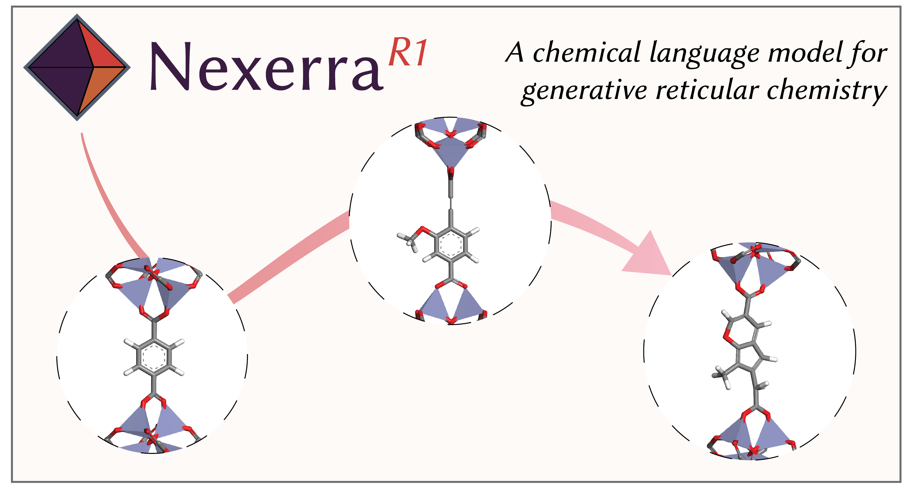
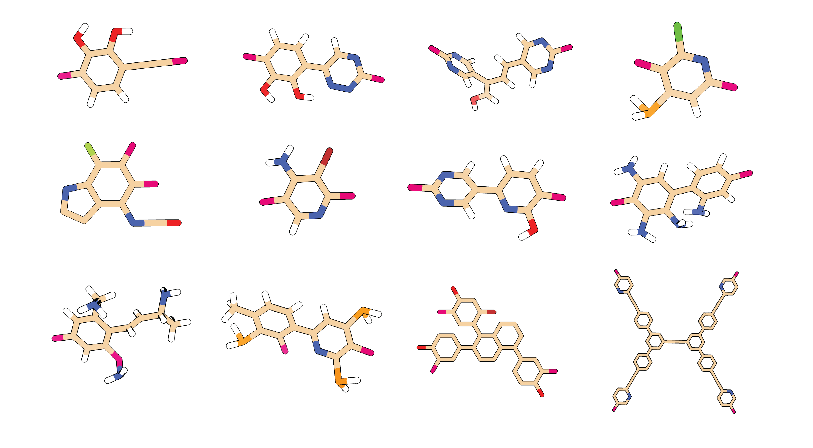

> 🚧 **Under Construction:**  
> This is an initial release of the functionality. Further documentation and cleanup are still in progress. Currently only model training and inference is supported. Everything currently documented in this README should be runnable. If you encounter challenges, reach out to dm958[at]cam[dot]ac[dot]uk.

> This repository will be under continuous development; a stable version will be released upon final publication.

# Nexerra-R1


[](LICENSE.md)
[](pyproject.toml)
[](https://doi.org/10.5281/zenodo.22284384)

### Update: NexerraR1 has been accepted for publication in JACS!

Open-source code for NexerraR1 as described in the following [pre-print](https://arxiv.org/abs/2603.20389).

```bib
@article{menon2026chemical,
  title={A chemical language model for reticular materials design},
  author={Menon, Dhruv and Singh, Vivek and Chen, Xu and Kiapi, Mohammad Reza Alizadeh and Zyuzin, Ivan and Macleod, Hamish W and Rampal, Nakul and Shepard, William and Yaghi, Omar M and Fairen-Jimenez, David},
  journal={arXiv preprint arXiv:2603.20389},
  year={2026}
}
```

This repository currently focuses on model training and inference for:
- direct linker design using the 'Direct Design' mode
- scaffold-constrained linker design using the 'Scaffold-constrained Design' mode
- flow-guided linker design using the 'Flow Design' mode

## Set-up
<a id="set-up"></a>

The default install is for pretrained inference. Training from scratch and MOF construction utilities are [optional] extras. Use Conda only when compiled chemistry dependencies fail to install cleanly through `uv`.

### 1. Clone the repo

```bash
git clone https://github.com/fairen-group/nexerra-r1.git
cd nexerra-R1
```

### 2. Install for pretrained inference

From the repo root:

```bash
uv venv
source .venv/bin/activate
uv pip install -e .
```

Download the pretrained checkpoints and tokenized dataset:

```bash
nexerra-download-assets --zenodo-record 22284384
```

Sanity-check the installed CLI:

```bash
nexerra-flow-design --help
```

### 3. Install for training from scratch

Start from the inference install above, then add the training dependencies:

```bash
uv pip install -e ".[train]"
```

Then follow the [Model Training](#model-training) workflow:
- preprocess the raw training CSV
- train the VAE linker model
- build the latent bank
- train the OT-CFM flow model

### 4. Install MOF construction utilities

The default inference install does not include Open Babel, ASE, or Pymatgen. If you need the utilities under `nexerra/build/`, install:

```bash
uv pip install -e ".[build]"
```

The `nexerra/build/` scripts still expect an external `tobacco3.0` installation.

### 5. Conda fallback

Use this path if `uv` fails on RDKit/Open Babel/Pymatgen or if you want the full curated chemistry environment:

```bash
conda env create -f environment.yml
conda activate nexerra
pip install -e .
```

For training in the Conda environment:

```bash
pip install -e ".[train]"
```

### Runtime Assets

The current inference code expects:

```text
artifacts/ckpt/vae/no_prop_vae_epoch_120.pt
artifacts/ckpt/flow/otcfm_step_180000_len.pt
artifacts/latent_banks/latent_bank.pt
artifacts/latent_banks/latent_bank_len.pt
data/processed/tokenized_dataset.pkl
data/processed/train_smiles.txt
designed/linker/inference_config.txt
```

The asset bootstrapper downloads:
- `artifacts/ckpt/vae/no_prop_vae_epoch_120.pt`
- `artifacts/ckpt/flow/otcfm_step_180000_len.pt`
- `artifacts/latent_banks/latent_bank.pt`
- `artifacts/latent_banks/latent_bank_len.pt`
- `data/processed/tokenized_dataset.pkl`

`zenodo_get` is the preferred download path. If it fails, use direct file URLs:

```bash
nexerra-download-assets --base-url "https://zenodo.org/records/22284384"
```

## Usage
> [!TIP]
> For best results, run inference in FlowDesign and/or ScaffDesign modes.


> Representative examples of the generative capabilities of Nexerra-R1.
<a id="inference"></a>

The main production-relevant inference entrypoints are:

```text
nexerra/inference/FlowDesign.py
```

After installation, run flow-guided inference with:

```bash
nexerra-flow-design --alpha 0.9 --num-samples 1000 --batch-size 128 --reward gas --threshold 0.5 --filters
```

By default, FlowDesign reads one seed SMILES from `designed/linker/run/input.txt`; scaffold-constrained design uses `designed/linker/run/input_scaf.txt`.

and

```text
nexerra/inference/ScafDesign.py
```

This path uses CUDA automatically when a working GPU PyTorch install is available:

```python
torch.device('cuda' if torch.cuda.is_available() else 'cpu')
```

## Supported Modes
<a id="supported-modes"></a>

### Direct Design

The direct design path uses:

```text
nexerra/inference/Design.py
```

For instructions on using this mode, look at:

```text
designed/linker/README.md
```

### Scaffold-Constrained Design

The scaffold-constrained path uses:

```text
nexerra/inference/ScafDesign.py
```

For instructions on using this mode, look at:

```text
designed/linker/README.md
```

### Flow-Guided Seeded Design

The flow-guided seeded design path uses:

```text
nexerra/inference/FlowDesign.py
```

This combines the pretrained VAE with a latent OT-CFM model and uses the flow checkpoint to steer decoding.

## Example Inputs
<a id="example-inputs"></a>

Example linker inputs are documented in:

```text
designed/linker/README.md
```

That file includes examples for:
- direct design
- scaffold-constrained design

## Model Training
<a id="model-training"></a>

To train from scratch, install the training dependencies before running this workflow:

```bash
uv pip install -e ".[train]"
```

The training workflow has two stages:
- train the VAE linker model
- build a latent bank and train the OT-CFM flow model on top of the pretrained VAE

>[!IMPORTANT]
>Training wall-clock time was not systematically benchmarked, but in our runs the base VAE and flow model together took approximately 48 hours each on an NVIDIA RTX 5080.

### 1. Prepare tokenized training data

From `nexerra/utils/`, preprocess the raw training CSV into the tokenized dataset bundle used by both the VAE and flow stages:

```bash
python preprocess.py --mode gen --src ../../data/raw/training_dataset.csv --dst ../../data/processed
```

This produces artifacts such as:
- `data/processed/tokenized_dataset.pkl`
- `data/processed/tok2id.json`
- `data/processed/id2tok.json`

### 2. Train the VAE model

The VAE training entrypoint is:

```text
nexerra/model/Trainer.py
```

Run it from `nexerra/model/` with the tokenized dataset and the raw training CSV:

```bash
python Trainer.py \
  --data ../../data/processed/tokenized_dataset.pkl \
  --rs ../../data/raw/training_dataset.csv \
  --batch 128 --ckpt ../../artifacts/ckpt/vae/
```

The production-oriented defaults in the training script use a `latent_dim` of `128`. Checkpoints are written per epoch as:

```text
artifacts/ckpt/vae/vae_epoch_<n>.pt
```

To resume training from an existing checkpoint:

```bash
python Trainer.py \
  --data ../../data/processed/tokenized_dataset.pkl \
  --rs ../../data/raw/training_dataset.csv \
  --batch 128 \
  --resume ../../artifacts/ckpt/vae/vae_epoch_<n>.pt \
  --epoch <n>
```

### 3. Build the latent bank

The flow model is trained on latent encodings produced by the pretrained VAE. Build the latent bank from the training SMILES list using:

```text
nexerra/cfm/build_bank.py
```

Run it from `nexerra/cfm/`:

```bash
python build_bank.py \
  --mode build \
  --data ../../data/processed/train_smiles.txt \
  --batch_size 128 \
  --savepath ../../artifacts/latent_banks/latent_bank.pt
```

This script loads the VAE checkpoint from `artifacts/ckpt/vae/no_prop_vae_epoch_120.pt` by default and writes the latent bank to the path you provide.

### 4. Train the OT-CFM flow model

The flow training entrypoint is:

```text
nexerra/cfm/otcfm_trainer.py
```

Run it from `nexerra/cfm/` using the latent bank built in the previous step:

```bash
python otcfm_trainer.py \
  --latent_pt ../../artifacts/latent_banks/latent_bank.pt \
  --percentile_start 70 \
  --percentile_end 100 \
  --steps 50000 \
  --batch 2048 \
  --out_path ../../artifacts/ckpt/flow/otcfm_step_50000.pt
```

Important defaults from the training script:
- the flow trainer reloads the pretrained VAE from `artifacts/ckpt/vae/no_prop_vae_epoch_120.pt`
- the tokenizer bundle is loaded from `data/processed/tokenized_dataset.pkl`
- `--matcher otcfm` is the active matcher choice
- `--mode max` or `--mode min` controls whether the conditioned property is maximized or minimized

The percentile arguments define the property slice used for conditional flow matching. Adjust them to match the reward/property regime you want the model to learn.

### 5. Evaluate a trained flow checkpoint

The same flow training script also supports evaluation sweeps over guidance scales:

```bash
python otcfm_trainer.py \
  --eval_ckpt ../../artifacts/ckpt/flow/otcfm_step_50000.pt \
  --eval_scales 0.0,1.0,1.5,2.0,3.0 \
  --eval_samples 10000
```

## Repository Layout
<a id="repository-layout"></a>

```text
.
├── nexerra                          <- Core source code
│   ├── model                        <- VAE architecture and VAE training code
│   ├── cfm                          <- Latent bank construction and OT-CFM flow training
│   ├── inference                    <- Direct, scaffold-constrained, and flow-guided inference entrypoints
│   ├── build                        <- MOF/CIF construction utilities
│   └── utils                        <- Tokenization, preprocessing, analysis, and helper modules
├── artifacts                        <- External/runtime artifacts and training outputs
│   ├── ckpt                         <- VAE and flow checkpoints
│   ├── latent_banks                 <- Saved latent bank tensors for flow training/inference
│   └── logs                         <- Training and metrics outputs
├── data                             <- Dataset inputs and processed training assets
│   ├── raw                          <- Raw CSV datasets
│   ├── processed                    <- Tokenized dataset bundle and split SMILES files
│   ├── analysis                     <- Analysis text outputs and summary statistics
│   └── figures                      <- Generated training/evaluation figures
├── designed                         <- User-facing design inputs, outputs, and references
│   ├── linker                       <- Inference config, sample inputs, and runtime linker I/O
│   ├── reference                    <- Reference linkers, CIFs, and scaffold assets
│   └── cif                          <- CIF-side generated artifacts and examples
├── assets                           <- README/demo assets
├── environment.yml                  <- Conda environment definition
├── setup_assets.py                  <- Bootstrap external runtime assets from Zenodo
├── setup.py                         <- Thin compatibility wrapper for the asset bootstrapper
├── LICENSE.md                       <- MIT license
└── README.md                        <- Project documentation
```

## Dependencies
<a id="dependencies"></a>

Dependency groups are defined in `pyproject.toml`:

- default install: pretrained inference and asset download
- `.[train]`: VAE training, OT-CFM flow training, preprocessing, and analysis
- `.[build]`: MOF construction helpers that need ASE, Pymatgen, and Open Babel
- `.[dev]`: test dependencies

For pretrained inference:

```bash
uv pip install -e .
```

For training from scratch:

```bash
uv pip install -e ".[train]"
```

For MOF construction utilities:

```bash
uv pip install -e ".[build]"
```

The default install covers:
- direct, scaffold-constrained, and flow-guided inference
- pretrained asset download via `nexerra-download-assets`

The training extra adds dependencies for:
- VAE training and preprocessing
- OT-CFM flow training
- analysis and diagnostics utilities

Additional notes:
- If `uv pip install -e .` fails on compiled chemistry dependencies, use the Conda fallback in the setup section.
- The Open Babel-based helper under `nexerra/build/addH.py` can be installed with `uv pip install -e ".[build]"`, but Conda is usually more reliable for Open Babel.
- MOF construction utilities under `nexerra/build/` still expect an external `tobacco3.0` package. Alternatively, the system can be made compatible with PoreMake. 
- The bio/reward subproject under `nexerra/inference/bio/` has its own dependency definition in `nexerra/inference/bio/pyproject.toml`.
- The SCScore code under `nexerra/utils/scscore/` includes some legacy utilities, but normal Nexerra inference does not require the full legacy SCScore training stack. If you use this part, please cite the parent publication as,

```bib
@article{coley2018scscore,
  title={SCScore: synthetic complexity learned from a reaction corpus},
  author={Coley, Connor W and Rogers, Luke and Green, William H and Jensen, Klavs F},
  journal={Journal of chemical information and modeling},
  volume={58},
  number={2},
  pages={252--261},
  year={2018},
  publisher={ACS Publications}
}
```

## Funding
This work was primarily carried out at the Adsorption and Advanced Materials (A2ML) Laboratory. Supported by the Winton Cambridge - Berkeley Exchange Fellowship, the Engineering and Physical Sciences Research Council (EPSRC), the Trinity Henry-Barlow (Honorary) Scholarship and Harding Distinguished Postgraduate Scholarship Programme. The authors further acknowledge the allocation of beamtime at Synchrotron SOLEIL and the help of the PROXIMA 2A staff in performing SCXRD experiments.
